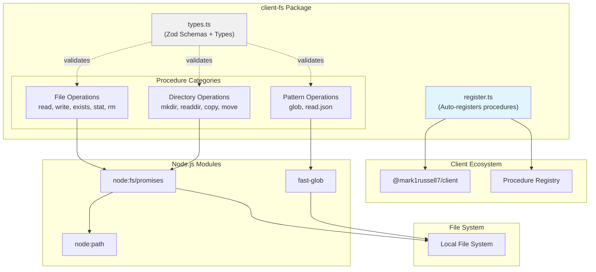

# @mark1russell7/client-fs

[](https://opensource.org/licenses/MIT)
[](https://www.typescriptlang.org/)
[](https://nodejs.org/)

File system operations as RPC procedures. Read, write, copy, move, glob files and directories via `client.call()`.

## Overview

`client-fs` provides comprehensive file system access through the client procedure ecosystem with:
- **File operations**: Read, write, stat, exists, remove
- **Directory operations**: Create, list, copy, move
- **Pattern matching**: Glob file search with fast-glob
- **JSON utilities**: Read and parse JSON files
- **Zod validation**: Runtime type safety on all inputs

The package auto-registers 11 procedures:
`fs.read`, `fs.write`, `fs.exists`, `fs.stat`, `fs.mkdir`, `fs.rm`, `fs.readdir`, `fs.copy`, `fs.move`, `fs.glob`, `fs.read.json`

## Architecture



### Package Dependency Flow

```mermaid
graph LR
    App["Your Application"]
    ClientFs["@mark1russell7/client-fs"]
    Client["@mark1russell7/client"]
    Zod["zod"]
    NodeModules["node:fs/promises<br/>fast-glob"]

    App --> ClientFs
    ClientFs --> Client
    ClientFs --> Zod
    ClientFs --> NodeModules

    App -.client.call.-> Client
    Client -.executes.-> ClientFs
    ClientFs -.validates.-> Zod
    ClientFs -.file ops.-> NodeModules
```

## Installation

```bash
npm install @mark1russell7/client-fs
```

### Peer Dependencies

```json
{
  "@mark1russell7/client": "github:mark1russell7/client#main",
  "zod": "^3.24.0"
}
```

## API Reference

### File Operations

#### `fs.read`

Read file contents as a string.

```typescript
const result = await client.call(
  ["fs", "read"],
  {
    path: "./config.json",
    encoding: "utf8"
  }
);

console.log(result.content);
console.log(result.stats.size);
```

**Input:**
```typescript
interface ReadInput {
  path: string;              // File path (absolute or relative)
  encoding?: string;         // Default: "utf8"
}
```

**Output:**
```typescript
interface ReadOutput {
  content: string;           // File contents
  path: string;              // Resolved absolute path
  stats: StatOutput;         // File statistics
}
```

#### `fs.write`

Write content to a file.

```typescript
await client.call(
  ["fs", "write"],
  {
    path: "./output.txt",
    content: "Hello, World!",
    mode: "write"  // or "append"
  }
);
```

**Input:**
```typescript
interface WriteInput {
  path: string;              // File path
  content: string;           // Content to write
  encoding?: string;         // Default: "utf8"
  mode?: "write" | "append"; // Default: "write"
}
```

**Output:**
```typescript
interface WriteOutput {
  path: string;              // Written file path
  bytesWritten: number;      // Number of bytes written
}
```

#### `fs.exists`

Check if a path exists and get its type.

```typescript
const result = await client.call(
  ["fs", "exists"],
  { path: "./my-file.txt" }
);

if (result.exists) {
  console.log(`Path exists and is a ${result.stats.type}`);
}
```

**Input:**
```typescript
interface ExistsInput {
  path: string;
}
```

**Output:**
```typescript
type ExistsOutput =
  | { exists: false }
  | { exists: true; stats: StatOutput };
```

#### `fs.stat`

Get file or directory statistics.

```typescript
const result = await client.call(
  ["fs", "stat"],
  { path: "./my-directory" }
);

console.log(result.type);  // "file" | "directory" | "other"
console.log(result.size);  // Size in bytes
```

**Input:**
```typescript
interface StatInput {
  path: string;
}
```

**Output:**
```typescript
interface StatOutput {
  path: string;
  type: FileType;            // "file" | "directory" | "other"
  size: number;              // Size in bytes
  mtime: string;             // Modified time (ISO)
  ctime: string;             // Created time (ISO)
  atime: string;             // Accessed time (ISO)
  mode: number;              // Unix permissions
}

enum FileType {
  File = "file",
  Directory = "directory",
  Other = "other"
}
```

#### `fs.rm`

Remove a file or directory.

```typescript
// Remove file
await client.call(
  ["fs", "rm"],
  { path: "./old-file.txt" }
);

// Remove directory recursively
await client.call(
  ["fs", "rm"],
  {
    path: "./old-directory",
    recursive: true,
    force: true
  }
);
```

**Input:**
```typescript
interface RmInput {
  path: string;
  recursive?: boolean;       // Default: false
  force?: boolean;           // Ignore if doesn't exist (default: false)
}
```

**Output:**
```typescript
interface RmOutput {
  path: string;
  removed: boolean;          // false if didn't exist with force=true
}
```

### Directory Operations

#### `fs.mkdir`

Create a directory.

```typescript
await client.call(
  ["fs", "mkdir"],
  {
    path: "./new/nested/directory",
    recursive: true  // Create parents if needed
  }
);
```

**Input:**
```typescript
interface MkdirInput {
  path: string;
  recursive?: boolean;       // Default: true
}
```

**Output:**
```typescript
interface MkdirOutput {
  path: string;
  created: boolean;          // false if already existed
}
```

#### `fs.readdir`

List directory contents.

```typescript
const result = await client.call(
  ["fs", "readdir"],
  {
    path: "./src",
    recursive: true,
    includeStats: true
  }
);

result.entries.forEach(entry => {
  console.log(`${entry.type}: ${entry.path}`);
  if (entry.stats) {
    console.log(`  Size: ${entry.stats.size} bytes`);
  }
});
```

**Input:**
```typescript
interface ReaddirInput {
  path: string;
  recursive?: boolean;       // Default: false
  includeStats?: boolean;    // Default: false
}
```

**Output:**
```typescript
interface ReaddirOutput {
  path: string;
  entries: ReaddirEntry[];
}

interface ReaddirEntry {
  name: string;              // Entry name
  path: string;              // Full path
  type: FileType;            // "file" | "directory" | "other"
  stats?: StatOutput;        // If includeStats=true
}
```

#### `fs.copy`

Copy a file or directory.

```typescript
// Copy file
await client.call(
  ["fs", "copy"],
  {
    src: "./source.txt",
    dest: "./destination.txt",
    overwrite: true
  }
);

// Copy directory recursively
await client.call(
  ["fs", "copy"],
  {
    src: "./src-dir",
    dest: "./dest-dir",
    recursive: true
  }
);
```

**Input:**
```typescript
interface CopyInput {
  src: string;
  dest: string;
  recursive?: boolean;       // Default: true
  overwrite?: boolean;       // Default: false
}
```

**Output:**
```typescript
interface CopyOutput {
  src: string;
  dest: string;
}
```

#### `fs.move`

Move or rename a file or directory.

```typescript
await client.call(
  ["fs", "move"],
  {
    src: "./old-name.txt",
    dest: "./new-name.txt",
    overwrite: false
  }
);
```

**Input:**
```typescript
interface MoveInput {
  src: string;
  dest: string;
  overwrite?: boolean;       // Default: false
}
```

**Output:**
```typescript
interface MoveOutput {
  src: string;
  dest: string;
}
```

### Pattern Matching Operations

#### `fs.glob`

Find files matching a glob pattern using fast-glob.

```typescript
const result = await client.call(
  ["fs", "glob"],
  {
    pattern: "src/**/*.{ts,tsx}",
    cwd: "/my/project",
    absolute: true,
    dot: false
  }
);

console.log(result.matches);
// ["/my/project/src/index.ts", "/my/project/src/components/App.tsx", ...]
```

**Input:**
```typescript
interface GlobInput {
  pattern: string;           // Glob pattern (e.g., "**/*.ts")
  cwd?: string;              // Base directory (default: process.cwd())
  absolute?: boolean;        // Return absolute paths (default: false)
  dot?: boolean;             // Include dotfiles (default: false)
}
```

**Output:**
```typescript
interface GlobOutput {
  pattern: string;
  matches: string[];         // Matching file paths
}
```

**Glob Pattern Examples:**
```typescript
// All TypeScript files
"**/*.ts"

// All files in src directory
"src/**/*"

// TypeScript and JavaScript files
"**/*.{ts,js}"

// Exclude node_modules
"**/*.ts"  // fast-glob excludes node_modules by default

// Include test files
"**/*.{test,spec}.ts"
```

#### `fs.read.json`

Read and parse a JSON file.

```typescript
const result = await client.call(
  ["fs", "read.json"],
  { path: "./package.json" }
);

console.log(result.data);  // Parsed JSON object
```

**Input:**
```typescript
interface ReadJsonInput {
  path: string;
}
```

**Output:**
```typescript
interface ReadJsonOutput {
  path: string;
  data: unknown;             // Parsed JSON (cast to your type)
  stats: StatOutput;
}
```

**Type-safe example:**
```typescript
interface PackageJson {
  name: string;
  version: string;
  dependencies: Record<string, string>;
}

const result = await client.call(
  ["fs", "read.json"],
  { path: "./package.json" }
);

const pkg = result.data as PackageJson;
console.log(pkg.name, pkg.version);
```

## Usage Examples

### Basic File Operations

```typescript
import { Client } from "@mark1russell7/client";

const client = new Client(/* config */);

// Read a file
const { content } = await client.call(
  ["fs", "read"],
  { path: "./README.md" }
);

// Write to a file
await client.call(
  ["fs", "write"],
  {
    path: "./output.txt",
    content: "Generated content\n",
    mode: "write"
  }
);

// Append to a file
await client.call(
  ["fs", "write"],
  {
    path: "./log.txt",
    content: `[${new Date().toISOString()}] Log entry\n`,
    mode: "append"
  }
);

// Check if file exists
const exists = await client.call(
  ["fs", "exists"],
  { path: "./config.json" }
);

if (exists.exists) {
  // Get file stats
  const stats = await client.call(
    ["fs", "stat"],
    { path: "./config.json" }
  );
  console.log(`File size: ${stats.size} bytes`);
}
```

### Directory Operations

```typescript
// Create nested directories
await client.call(
  ["fs", "mkdir"],
  {
    path: "./build/assets/images",
    recursive: true
  }
);

// List directory contents
const { entries } = await client.call(
  ["fs", "readdir"],
  {
    path: "./src",
    includeStats: true
  }
);

entries.forEach(entry => {
  if (entry.type === "file") {
    console.log(`File: ${entry.name} (${entry.stats?.size} bytes)`);
  } else {
    console.log(`Directory: ${entry.name}`);
  }
});

// Recursive directory listing
const { entries: allFiles } = await client.call(
  ["fs", "readdir"],
  {
    path: "./src",
    recursive: true
  }
);

console.log(`Total items: ${allFiles.length}`);
```

### Copy and Move Operations

```typescript
// Backup a file
await client.call(
  ["fs", "copy"],
  {
    src: "./important-data.json",
    dest: "./backups/important-data.backup.json"
  }
);

// Copy entire directory
await client.call(
  ["fs", "copy"],
  {
    src: "./templates",
    dest: "./build/templates",
    recursive: true,
    overwrite: true
  }
);

// Rename a file
await client.call(
  ["fs", "move"],
  {
    src: "./old-name.txt",
    dest: "./new-name.txt"
  }
);

// Move to different directory
await client.call(
  ["fs", "move"],
  {
    src: "./temp/file.txt",
    dest: "./archive/file.txt",
    overwrite: false
  }
);
```

### Pattern Matching with Glob

```typescript
// Find all TypeScript files
const { matches: tsFiles } = await client.call(
  ["fs", "glob"],
  {
    pattern: "**/*.ts",
    cwd: "./src",
    absolute: true
  }
);

console.log(`Found ${tsFiles.length} TypeScript files`);

// Find test files
const { matches: testFiles } = await client.call(
  ["fs", "glob"],
  {
    pattern: "**/*.{test,spec}.{ts,js}",
    cwd: "."
  }
);

// Find config files
const { matches: configs } = await client.call(
  ["fs", "glob"],
  {
    pattern: "**/*.config.{js,ts,json}",
    dot: true  // Include dotfiles like .eslintrc.json
  }
);
```

### JSON File Operations

```typescript
// Read package.json
const { data: pkg } = await client.call(
  ["fs", "read.json"],
  { path: "./package.json" }
);

console.log(`Package: ${pkg.name}@${pkg.version}`);

// Read tsconfig.json
const { data: tsconfig } = await client.call(
  ["fs", "read.json"],
  { path: "./tsconfig.json" }
);

console.log("Compiler options:", tsconfig.compilerOptions);

// Read and modify JSON
const { data: config } = await client.call(
  ["fs", "read.json"],
  { path: "./config.json" }
);

config.lastUpdated = new Date().toISOString();

await client.call(
  ["fs", "write"],
  {
    path: "./config.json",
    content: JSON.stringify(config, null, 2)
  }
);
```

### Build Script Example

```typescript
// Clean build directory
await client.call(
  ["fs", "rm"],
  {
    path: "./dist",
    recursive: true,
    force: true
  }
);

// Create build directory
await client.call(
  ["fs", "mkdir"],
  { path: "./dist" }
);

// Find all source files
const { matches: sourceFiles } = await client.call(
  ["fs", "glob"],
  {
    pattern: "src/**/*.ts",
    absolute: true
  }
);

// Process each file...
for (const file of sourceFiles) {
  const { content } = await client.call(
    ["fs", "read"],
    { path: file }
  );

  // Transform content...
  const transformed = content.replace(/\.ts$/, ".js");

  await client.call(
    ["fs", "write"],
    {
      path: file.replace("src/", "dist/").replace(".ts", ".js"),
      content: transformed
    }
  );
}

// Copy assets
await client.call(
  ["fs", "copy"],
  {
    src: "./public",
    dest: "./dist/public",
    recursive: true
  }
);
```

## Integration with Ecosystem

### Bundle Packages

`client-fs` can be included in bundle packages:

```typescript
// In bundle-dev/src/register.ts
import "@mark1russell7/client-fs/register.js";
import "@mark1russell7/client-shell/register.js";
import "@mark1russell7/client-cli/register.js";
```

## Dependencies

### Runtime Dependencies

- **@mark1russell7/client** - Core client procedure system
- **zod** (^3.24.0) - Runtime type validation

### Implicit Dependencies

- **node:fs/promises** - Node.js file system promises API
- **node:path** - Node.js path utilities
- **fast-glob** - Fast glob pattern matching (imported in glob procedure)

### Development Dependencies

- **@mark1russell7/cue** - Configuration and type utilities
- **typescript** (^5.9.3) - TypeScript compiler
- **@types/node** (^22.0.0) - Node.js type definitions

## Package Structure

```
client-fs/
├── src/
│   ├── types.ts                  # Zod schemas + TypeScript types
│   ├── register.ts               # Auto-registration
│   ├── index.ts                  # Main entry point
│   ├── procedures/
│   │   ├── fs.ts                 # Barrel export
│   │   └── fs/
│   │       ├── index.ts          # Procedure exports
│   │       ├── read.ts           # fs.read
│   │       ├── write.ts          # fs.write
│   │       ├── exists.ts         # fs.exists
│   │       ├── stat.ts           # fs.stat
│   │       ├── mkdir.ts          # fs.mkdir
│   │       ├── rm.ts             # fs.rm
│   │       ├── readdir.ts        # fs.readdir
│   │       ├── copy.ts           # fs.copy
│   │       ├── move.ts           # fs.move
│   │       ├── glob.ts           # fs.glob
│   │       └── json.ts           # fs.read.json
├── dist/                         # Compiled output
├── package.json
├── tsconfig.json
└── README.md
```

## Development

### Build

```bash
npm run build
```

### Type Check

```bash
npm run typecheck
```

### Clean

```bash
npm run clean
```

## License

MIT

## Author

Mark Russell <marktheprogrammer17@gmail.com>
